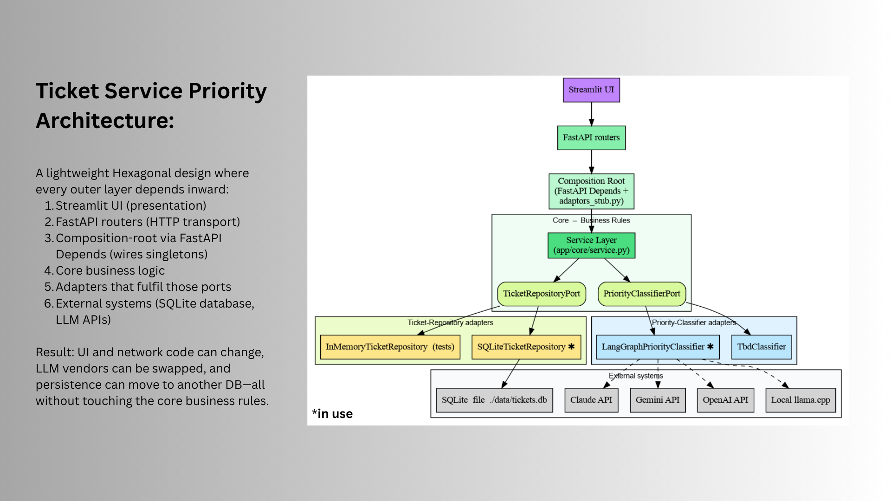

# 🎫 Ticket Priority Service

A tiny, production-style micro-service that lets you:

* create, read, update and delete support tickets
* auto-classify each ticket’s priority with an LLM
* browse the data through a Streamlit UI

The code follows a clean “ports & adapters” layout (FastAPI → Service Layer → Repos / LLM adapter)
and is fully containerised with Docker Compose.



---

## 1. Quick-start (Docker Compose)

Prerequisites: Docker 19.03+ and Docker Compose v2.

```bash
# 1 – clone
git clone https://github.com/darkfennertrader/ticket-service-priority.git
cd ticket-service-priority

# 2 – set env-vars (copy env.example if you need to tweak anything)
cp env.example .env

# set inside the copied .env the following vars if needed:
OPENAI_API_KEY="sk-..."       # real key for live priority classification with an OPEN_AI LLM
API_HOST_PORT=...             # set it to whatever number if port 8000 is already in use
UI_HOST_PORT=...              # set it to whatever number if port 8501 is already in use


# 3 – launch the full stack
docker compose up --build
```

Compose does three things:

1. `init-db` – one-shot container that creates the `tickets` table in SQLite  
2. `api`     – FastAPI backend on <http://localhost:your_local_port>  
3. `frontend` – Streamlit UI frontend on <http://localhost:your_local_port>

Stop everything with `CTRL-C` and wipe volumes with `docker compose down -v`.

---

## 2. REST API Cheat-sheet

(The interactive Swagger docs live at `/docs`)

| Verb & path                 | Purpose                                                             |
|-----------------------------|---------------------------------------------------------------------|
| `POST   /tickets`           | Create a new ticket                                                 |
| `GET    /tickets`           | List tickets — optional filters `status_filter`, `priority_filter`  |
| `GET    /tickets/{id}`      | Retrieve one ticket                                                 |
| `PATCH  /tickets/{id}`      | Update `title`, `description` or `status`                           |
| `DELETE /tickets/{id}`      | Delete a ticket                                                     |

### Example calls with `curl`

CREATE:
```bash
curl -X POST http://localhost:<YOUR_PORT>/tickets \
     -H "Content-Type: application/json" \
     -d '{ "title": "Prod down", "description": "Login is impossible" }'
```

LIST ALL TICKETS:
```bash
curl "http://localhost:<YOUR_PORT>/tickets"
```
LIST (only OPEN+HIGH):
```bash
curl "http://localhost:<YOUR_PORT>/tickets?status_filter=OPEN&priority_filter=HIGH"
```

UPDATE STATUS:
```bash
curl -X PATCH http://localhost:<YOUR_PORT>/tickets/<UUID> \
     -H "Content-Type: application/json" \
     -d '{ "status": "IN_PROGRESS" }'
```

DELETE:
```bash
curl -X DELETE http://localhost:<YOUR_PORT>/tickets/<UUID>
```

---

## 3. LLM Prompt Template

When a ticket is created the service sends **exactly** the prompt below to the LLM and expects a single word (`HIGH`, `MEDIUM` or `LOW`) in response.  
If the call fails (no API key, network error, etc.) the priority silently falls back to **TBD**.

```text
You are an automated support-ticket triage assistant for our engineering team.

TASK
1. Read the ticket title and description.
2. Decide the priority according to the POLICY below.
3. Reply with ONE WORD ONLY—exactly HIGH, MEDIUM, or LOW—uppercase, with no
   other text, punctuation, or line breaks.

POLICY
HIGH   - Full production outage, data loss, security breach, payment failure,
         or any issue that blocks customers from using a core feature.
MEDIUM - Partial outage, severe performance degradation, significant bug with a
         workaround, or time-sensitive issue that is not mission-critical.
LOW    - Cosmetic defect, minor usability issue, documentation request, feature
         idea, or general question that can be scheduled for later.
```

---

## 4. Running the Test-suite

The project ships with:

* unit tests for the AI integration (LLM calls are 100 % mocked)
* black-box integration tests for the full FastAPI router

### 4.1. Locally (host machine)

```bash
python -m venv .venv          # optional but recommended
source .venv/bin/activate
pip install -r requirements.txt
pytest -q
```

### 4.2. Inside Docker

You can also execute the very same tests against the API image:

```bash
docker compose run --rm \
  -v "$(pwd)/tests":/usr/src/app/tests \
  api pytest -q
```

Both ways finish in a few seconds and require no real OpenAI key.

---

Happy hacking! 🚀